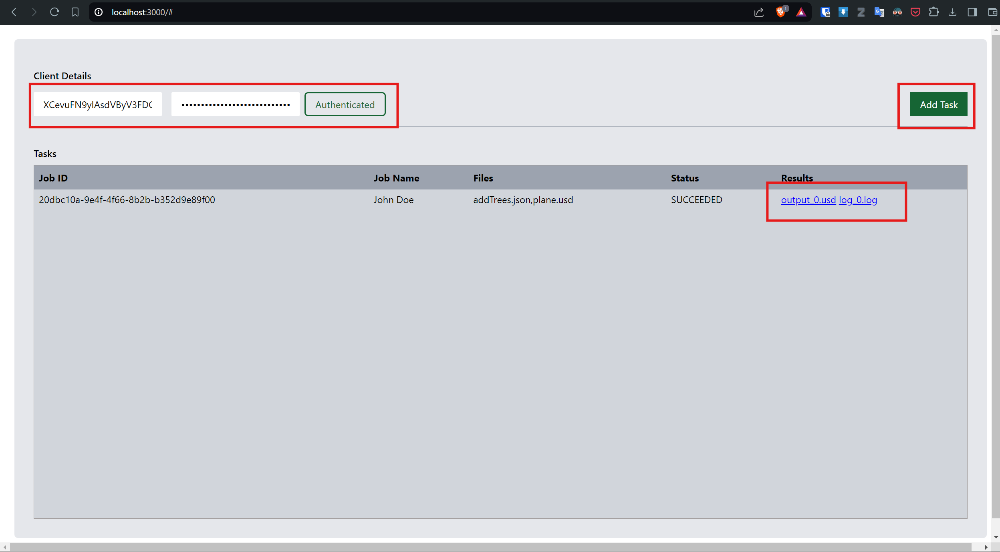
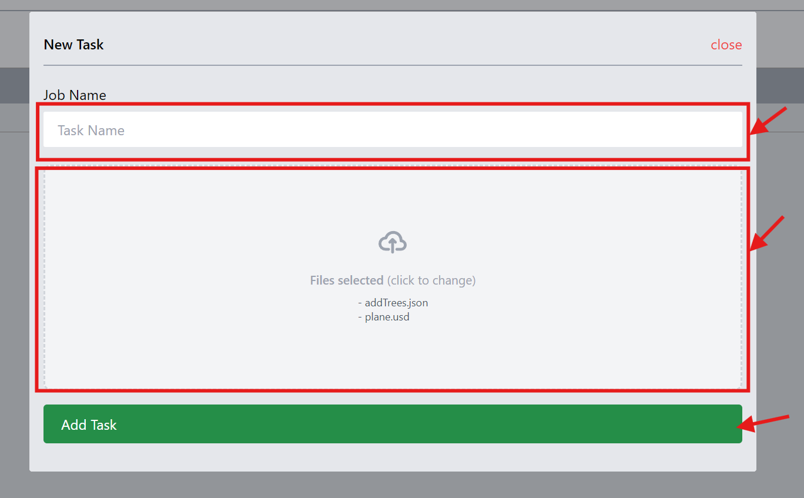

# Flow Graph Engine Queue
This is a sample for monitoring Flow Graph Engine Queues using the REST API.

> Note: This is still in development stage, may break or change in future versions.

# Prerequisites
- Node.js installed and available on ***$PATH***, ie, the command ```node --version``` on the terminal works
- Any preferred IDE & Browser

# Running
- ```git clone <repo>```
- ```cd <repo dir>```
- ```npm install``` to install the packages
- ```node server/server.js``` or (```nodemon server/server.js``` for developement)
- In your browser, open [http://127.0.0.1:3000](http://127.0.0.1:3000) (dev server for the frontend). You should be greeted with a window an shown in the image [below](#using-the-platform). A rebuilt UI is shipped with the server.

The express server will run on port ```3000``` as expected on the frontend.

# Using the platform
- Launch the server as shown in [Running](#running) above.
- Log in using your authentication details (Client ID and Client Credentials). Note that the returned token has a validity period beyond which, you have to authenticate again.
- When authenticated, the ```Add Task``` button is shown. Click on it to open the dialog to create a new task.
- On the new task dialog, give the ```Job Name```, and select exactly 2 files (One being the .usd file and the other the .json [bifrost file]).
- One done, submit the form.
- The job submission may take a couple of seconds, depending on the file sizes being uploaded, but once completed, the task is added to the table as shown below.
- The Status will be querried automatically for you and updated.The final status should either be ```FAILED```, ```SUCCEEDED``` or ```CANCELLED```.
- Once completed, the results column will have at least a file which is either one or more log files and one or more output .usd files.
- To check the files, click on the intended file and the parent folder where these files have been downloaded to will be open on the ```Windows Explorer```

 

 

# Issues?
Open a new issue.
